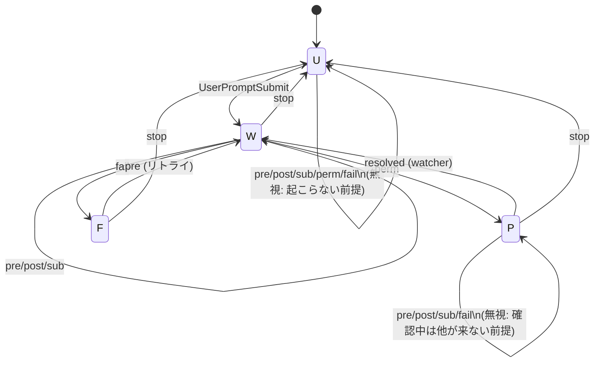

# zellij tab status: 非同期フックの状態遷移バグ

対象: `modules/terminal/zellij/scripts/claude-tab-status.sh`
ブランチ: `fix/zellij-tab-status-race`

## 発端

zellijのタブアイコンが「作業中(⏳)」のまま、実際は作業中ではない状態で止まっていた。

## 発見した不具合

1. **🔔(NEEDS_USER)の取り残し**: `pane 7`（mini-harnessプロジェクト）で、画面には権限確認ダイアログが表示されているのに、アイコンは⏳のまま約47秒間更新されなかった。
2. **✅(DONE)からの巻き戻り**: この会話自身のペインで、✅表示から数秒以内（ユーザーは何も入力していない）に⏳へ勝手に変わった。

## 原因調査の経緯

### 仮説1: TS取得タイミングの問題（→ 部分的にしか正しくなかった）

当初のスクリプトは、各フックイベント発火時に `TS=$(date +%s%N)` を取得し、「stateファイルに保存されているTSより新しいイベントだけが書き込みを許可される」という Last-Write-Wins 方式だった。

- `TS`取得が重い`zellij action list-panes`呼び出しより**前**にあると、呼び出しの所要時間差で「発生順」と「書き込み完了順」が入れ替わり、新しいイベントが古いイベントに上書きされることがあった（🔔がPreToolUseのBUSYに上書きされる事例）。
- `TS`取得位置を`list-panes`呼び出しの**後**（書き込み直前）に移すことで、この特定の逆転は緩和されたが、根本原因ではなかった。

### 仮説2: hookの順序保証を公式ドキュメントで確認

Claude Code公式hooksドキュメントを調査した結果:

- フックの**起動順序**がイベント発生順と一致する保証: **記載なし**
- `async: true`のフック同士の**完了順序**の保証（`Stop`が前の`PostToolUse`の完了を待つ保証）: **記載なし**
- 順序を復元するための sequence number / dispatch timestamp: **hookの入力JSONには存在しない**
- `prompt_id`（UUID、現在処理中のプロンプトを識別）は存在するが、全イベント種別への付与や`SubagentStop`での扱いは**記載なし**（実測が必要、未実施）

結論: **非同期フックの完了順序は保証されない**。TSの前後関係で勝敗を決めるアルゴリズムは、原理的に脆弱。

### 仮説3: ポーリング方式（herdr参考）の検討 → 見送り

`ogulcancelik/herdr`（Rust製エージェントマルチプレクサ）は、hookイベントに依存せず「画面末尾テキストのパターンマッチ + PTY出力アクティビティ」を状態判定の主軸にしている。この方式はより堅牢だが:

- 実測コスト: `zellij action dump-screen`呼び出し1回あたり約15ms
- 全paneを常時1秒間隔でポーリングすると、1paneあたりCPU使用率約1.5%
- bashスクリプト＋外部プロセス起動という構造上、herdrのようなネイティブ常駐デーモンに比べて非効率

→ 既存の`__watch`（🔔状態の時だけ限定的にポーリング）程度の使用に留め、全面移行はしない。

## 採用した解決策: 状態遷移ベースの判定

TSの前後比較をやめ、`should_write(stored_icon, hook_event)` という状態遷移の意味論だけで書き込み可否を決定する設計に変更。

### 状態遷移表

| 現在状態 | 入力 | 次状態 |
|---|---|---|
| U (DONE ✅) | UserPromptSubmit | W |
| W (BUSY ⏳) | PreToolUse / PostToolUse / SubagentStop | W |
| W | PermissionRequest / Notification | P |
| W | PostToolUseFailure | F |
| W | Stop | U |
| P (NEEDS_USER 🔔) | resolved（watcherがダイアログ消滅を検知） | W |
| P | Stop | U |
| F (FAILED ✗) | PreToolUse（リトライ） | W |
| F | Stop | U |
| **U** | **pre/post/sub/perm/fail** | **U（自己ループ = 無視）** |
| P | pre/post/sub/fail | P（自己ループ = 無視） |

### 状態遷移図

### この設計が健全である前提（重要）

- **大幅な通知の遅延はない**: 同一ターン内のイベントは、次のターンが始まる前には全て届く
- **`Failure`の後に直接`DONE`になる順序の乱れは起きない**: `U`(DONE)に`fail`が届くような順序逆転は発生しない

これらの前提のもとでは、`U`状態にいる間に届く`UserPromptSubmit`以外の全イベントは「そもそも存在しないはずの入力」であり、無視して安全。

### 検討して却下した設計: スタック（保留キュー）

「今は遷移不可能なイベントを捨てずに保留し、状態が変わったら再評価する」という設計を検討したが、以下の理由で採用しなかった:

- `Stop`後の遅延イベントは「今は無効だが将来有効になる情報」ではなく「ターンが終わった時点で永久に陳腐化した情報」。保留する対象が存在しない。
- 仮に保留・再生すると、`NEEDS_USER`（`PermissionRequest`）が新しいターンの`BUSY`状態に「今頃有効化」されて誤って復活する等、discardより悪化するケースがある。

## 実装

- `should_write()` を純粋関数として抽出し、bats等の外部依存なしで単体テスト（`ZELLIJ_TAB_STATUS_TEST`環境変数でCLI本体の実行をガードし、関数だけをsource可能にした）
- TSは勝敗判定から`__watch`ポーラー用の世代トークンへ役割を縮小
- 単体テスト11件 + 実機（zellijの実セッション）での統合確認: `Stop`後の遅延`PostToolUse`が✅を上書きしないこと、`UserPromptSubmit`で正しく次ターンへ遷移することを確認済み
- コミット済み（ブランチ`fix/zellij-tab-status-race`）

## 未解決・残タスク

- 🔔の取り残し（`pane 7`の事例）はTSの問題ではなく、`PermissionRequest`/`Notification`フック自体が発火していない、またはtimeout(5秒)で打ち切られている可能性が濃厚。デバッグログ（受信イベント名・timeout・timestampを`/tmp`に追記）による実測が必要だが、未実施。
- `prompt_id`の実挙動（全イベントへの付与、`SubagentStop`での扱い）も未実測。
