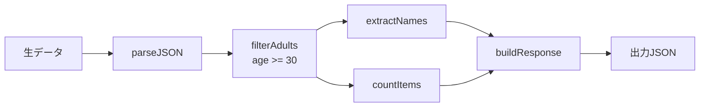

# Dataflow Design

## Overview

データ変換処理をフローチャート形式で設計し、入力データがどのように変換・加工されて出力されるかを可視化する。関数型プログラミング、パイプライン処理、ETL処理などの設計に適している。実装は行わず、設計図の提示で完了する。

## Design Workflow

### Step 1: 要件のヒアリング

AskUserQuestion ツールを使用して、以下を確認する:

1. **処理の概要**
   - どのようなデータを扱うか？（API レスポンス、ファイル、データベースなど）
   - 最終的にどのような形式のデータを出力したいか？

2. **変換ステップの概要**
   - データにどのような加工が必要か？（フィルタリング、集計、変換など）
   - 外部サービスとの連携は必要か？

**質問例:**
- 「入力データの形式と内容を教えてください（例: JSON、CSV、APIレスポンス）」
- 「どのようなデータ変換・加工を行いたいですか？」
- 「出力データの形式と用途を教えてください」

### Step 2: データ構造の定義

入力・中間・出力データの構造を明確化する:

**入力データ:**
```
{
  "users": [
    {"id": 1, "name": "Alice", "age": 30},
    {"id": 2, "name": "Bob", "age": 25}
  ]
}
```

**出力データ:**
```
{
  "adult_users": ["Alice"],
  "count": 1
}
```

不明確な点は AskUserQuestion で確認する。

### Step 3: 変換ステップの抽出

データの流れを段階的に分解する。各ステップで以下を定義:

- **入力**: ステップに渡されるデータ
- **処理**: 実行される変換ロジック
- **出力**: ステップから返されるデータ

**例:**
1. `parseJSON`: 生データ → JSON オブジェクト
2. `filterAdults`: ユーザー配列 → 30歳以上のユーザー配列
3. `extractNames`: ユーザー配列 → 名前の配列
4. `countItems`: 配列 → 個数
5. `buildResponse`: (名前配列, 個数) → レスポンスオブジェクト

### Step 4: データフロー図の作成

#### 方法A: Mermaid フローチャート



#### 方法B: ASCII フローチャート

```
  [生データ]
      |
      v
 +-----------+
 | parseJSON |
 +-----------+
      |
      v
 +--------------+
 | filterAdults |  (age >= 30)
 +--------------+
      |
      +----------+----------+
      |                     |
      v                     v
 +-------------+       +------------+
 |extractNames |       | countItems |
 +-------------+       +------------+
      |                     |
      +----------+----------+
                 |
                 v
          +--------------+
          | buildResponse|
          +--------------+
                 |
                 v
            [出力JSON]
```

**記法:**
- `[データ]`: 入力/出力データ
- `+-------+`: 処理・関数
- `----->`: データの流れ
- `(条件)`: フィルタ条件や変換ルール

### Step 5: データ変換詳細の定義

各ステップの詳細をテーブル形式で整理:

| ステップ | 入力 | 処理内容 | 出力 | 備考 |
|----------|------|----------|------|------|
| parseJSON | 文字列 | JSON.parse() | Object | エラー処理必要 |
| filterAdults | User[] | filter(u => u.age >= 30) | User[] | - |
| extractNames | User[] | map(u => u.name) | string[] | - |
| countItems | any[] | length プロパティ | number | - |
| buildResponse | (names, count) | オブジェクト構築 | Object | - |

### Step 6: エッジケースの検証

データフローの堅牢性を確認:

1. **空データ**: 入力が空配列・null の場合の処理
2. **不正データ**: 想定外の形式や欠損値の処理
3. **エラーハンドリング**: 各ステップでのエラー発生時の処理
4. **並列処理**: 複数の分岐が競合しないか
5. **パフォーマンス**: 大量データでのボトルネック

### Step 7: 設計成果物の提示

最終的な設計成果物を提示する:

1. **設計概要**
   - 処理の目的と概要

2. **データ構造定義**
   - 入力・中間・出力データのスキーマ

3. **データフロー図**
   - Mermaid または ASCII 形式

4. **変換ステップ詳細表**
   - 各ステップの処理内容

5. **エッジケースと対応方針**
   - 確認したエッジケースと処理方法

6. **実装時の考慮事項**
   - 推奨される実装パターン（パイプライン、関数合成など）
   - テスト観点（各ステップの単体テスト、統合テスト、エッジケース）

## Design Patterns

### パターン1: 線形パイプライン
```
Input → Transform1 → Transform2 → Transform3 → Output
```
単純な一方向の変換処理。関数型プログラミングの pipe/compose に適している。

### パターン2: 分岐・合流
```
       +--> PathA --+
Input -+            +--> Merge --> Output
       +--> PathB --+
```
データを複数経路で処理し、最後に統合する。並列処理や条件分岐に適している。

### パターン3: フィードバックループ
```
Input --> Process --> Check
             ^          |
             |          v
             +-- [retry]
                    |
                    v
                 Output
```
リトライ処理や反復処理。注意深く設計しないと無限ループの危険がある。

## Important Notes

- **設計のみで完了**: このスキルは設計図の作成で完了し、実装コードは書かない
- **不変性を意識**: 各ステップは入力を変更せず、新しいデータを返す設計を推奨
- **純粋関数**: 副作用のない変換を基本とし、副作用（API呼び出し、DB更新）は明示する
- **テスト容易性**: 各ステップが独立してテスト可能になるよう設計する

## References

データフロー設計パターンや詳細な例については、`references/dataflow_patterns.md` を参照すること。
