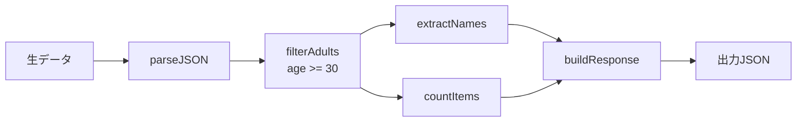
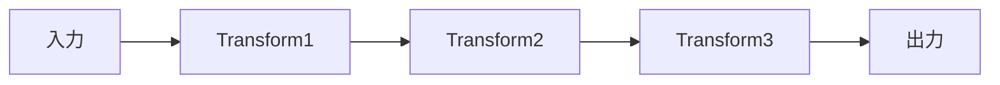
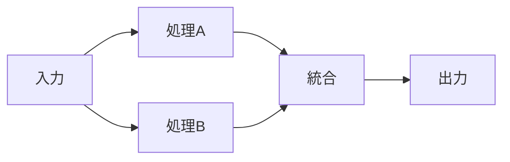
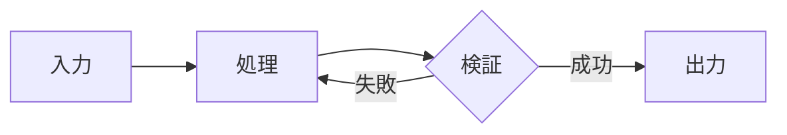

# Dataflow Design

## Overview

データ変換処理をフローチャート形式で設計し、入力データがどのように変換・加工されて出力されるかを可視化する。関数型プログラミング、パイプライン処理、ETL処理などの設計に適している。実装は行わず、設計図の提示で完了する。

## Design Workflow

### Step 1: 要件のヒアリング

AskUserQuestion ツールを使用して、以下を確認する:

1. **処理の概要**
   - どのようなデータを扱うか？（API レスポンス、ファイル、データベースなど）
   - 最終的にどのような形式のデータを出力したいか？

2. **変換ステップの概要**
   - データにどのような加工が必要か？（フィルタリング、集計、変換など）
   - 外部サービスとの連携は必要か？

**質問例:**
- 「入力データの形式と内容を教えてください（例: JSON、CSV、APIレスポンス）」
- 「どのようなデータ変換・加工を行いたいですか？」
- 「出力データの形式と用途を教えてください」

### Step 2: データ構造の定義

入力・中間・出力データの構造を明確化する:

**入力データ:**
```
{
  "users": [
    {"id": 1, "name": "Alice", "age": 30},
    {"id": 2, "name": "Bob", "age": 25}
  ]
}
```

**出力データ:**
```
{
  "adult_users": ["Alice"],
  "count": 1
}
```

不明確な点は AskUserQuestion で確認する。

### Step 3: 変換ステップの抽出

データの流れを段階的に分解する。各ステップで以下を定義:

- **入力**: ステップに渡されるデータ
- **処理**: 実行される変換ロジック
- **出力**: ステップから返されるデータ

**例:**
1. `parseJSON`: 生データ → JSON オブジェクト
2. `filterAdults`: ユーザー配列 → 30歳以上のユーザー配列
3. `extractNames`: ユーザー配列 → 名前の配列
4. `countItems`: 配列 → 個数
5. `buildResponse`: (名前配列, 個数) → レスポンスオブジェクト

### Step 4: データフロー図の作成

Mermaid フローチャート形式でデータフロー図を作成する:



**Mermaid記法:**
- `flowchart LR/TD`: 左右(LR)または上下(TD)のフローチャート
- `[ノード名]`: 入力/出力データ（角丸四角形）
- `[処理名]`: 処理・関数（四角形）
- `-->`: データの流れ
- `<br/>`: ノード内の改行
- 条件や分岐は `-->|ラベル|` で表現

### Step 5: データ変換詳細の定義

各ステップの詳細をテーブル形式で整理:

| ステップ | 入力 | 処理内容 | 出力 | 備考 |
|----------|------|----------|------|------|
| parseJSON | 文字列 | JSON.parse() | Object | エラー処理必要 |
| filterAdults | User[] | filter(u => u.age >= 30) | User[] | - |
| extractNames | User[] | map(u => u.name) | string[] | - |
| countItems | any[] | length プロパティ | number | - |
| buildResponse | (names, count) | オブジェクト構築 | Object | - |

### Step 6: エッジケースの検証

データフローの堅牢性を確認:

1. **空データ**: 入力が空配列・null の場合の処理
2. **不正データ**: 想定外の形式や欠損値の処理
3. **エラーハンドリング**: 各ステップでのエラー発生時の処理
4. **並列処理**: 複数の分岐が競合しないか
5. **パフォーマンス**: 大量データでのボトルネック

### Step 7: 設計ドキュメントの作成と保存

設計成果物を.md形式で作成し、保存する:

**ドキュメント構成:**

```markdown
# [機能名] データフロー設計

## 設計概要
- 処理の目的と概要

## データ構造定義

### 入力データ
[入力データのスキーマ]

### 出力データ
[出力データのスキーマ]

## データフロー図

```mermaid
flowchart LR
    [フロー図]
```

## 変換ステップ詳細

| ステップ | 入力 | 処理内容 | 出力 | 備考 |
|----------|------|----------|------|------|
[各ステップの詳細]

## エッジケースと対応方針
[エッジケース一覧と対応]

## 実装時の考慮事項
- 推奨パターン
- テスト観点
```

**保存先:** `[機能名]-dataflow.md`

### Step 8: 設計成果物の出力

**初回設計時:**
- 設計の要約をプロンプトに出力
- 主要なフロー、重要なポイント、考慮事項を簡潔に説明

**変更・更新時:**
- .mdファイルを更新
- 変更差分をプロンプトに出力
- 何を変更したか、なぜ変更したかを説明

## Design Patterns

### パターン1: 線形パイプライン



単純な一方向の変換処理。関数型プログラミングの pipe/compose に適している。

### パターン2: 分岐・合流



データを複数経路で処理し、最後に統合する。並列処理や条件分岐に適している。

**用途:**
- 同じデータを異なる方法で処理（例: 統計値の計算と詳細データの抽出）
- 並列処理による高速化
- 条件による分岐処理

### パターン3: フィードバックループ



リトライ処理や反復処理。注意深く設計しないと無限ループの危険がある。

**用途:**
- リトライロジック（API呼び出し、ネットワークリクエスト）
- 反復改善処理（データクレンジング、最適化）
- 条件が満たされるまでの繰り返し

**注意事項:**
- 必ず終了条件を設ける
- 最大リトライ回数を設定
- 無限ループを防ぐためのタイムアウトを実装

## Important Notes

- **Mermaid形式を使用**: データフロー図はMermaid形式で作成する
- **.md形式で保存**: 設計成果物は`[機能名]-dataflow.md`として保存する
- **初回は要約出力**: 最初の設計時は設計の要約をプロンプトに出力する
- **変更時は差分出力**: 設計を更新した場合は、変更差分をプロンプトに出力する
- **設計のみで完了**: このスキルは設計図の作成で完了し、実装コードは書かない
- **不変性を意識**: 各ステップは入力を変更せず、新しいデータを返す設計を推奨
- **純粋関数**: 副作用のない変換を基本とし、副作用（API呼び出し、DB更新）は明示する
- **テスト容易性**: 各ステップが独立してテスト可能になるよう設計する
