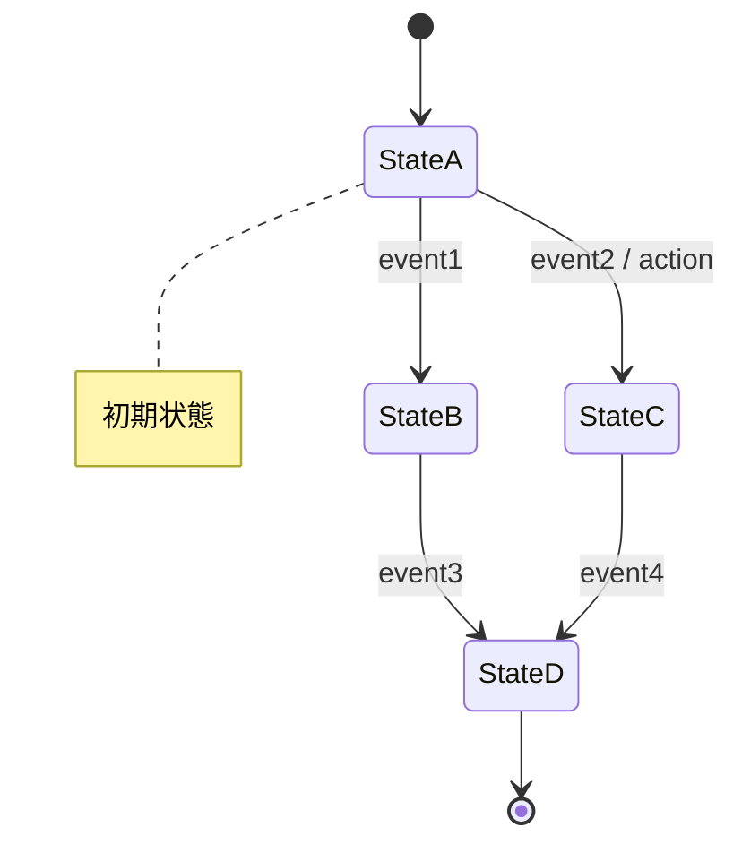
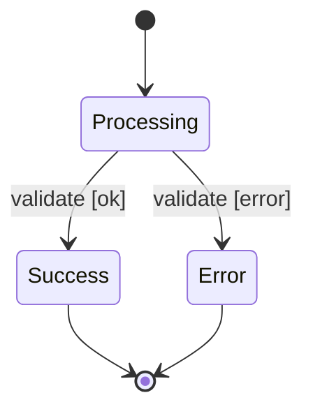

# State Machine Design

## Overview

対話形式で段階的にステートマシンを設計し、ASCII形式の状態遷移図と遷移表を作成する。ユーザーに質問しながら、状態・イベント・遷移条件を明確化し、エッジケースを検出する。設計完了後、実装は行わず設計図の提示で完了する。

## Design Workflow

### Step 1: 要件のヒアリング

AskUserQuestion ツールを使用して、以下を確認する:

1. **設計対象の機能・システムの概要**
   - 何を実装したいか？
   - 既存コードの設計か、新規機能の設計か？

2. **想定されるユースケース**
   - 主要なユーザー操作やシナリオは？
   - どのような流れで機能が使われるか？

**質問例:**
- 「この機能は、どのような状態を持ちますか？（例: ログイン前/ログイン中/ログイン済み）」
- 「ユーザーや外部システムからのどのようなアクションを想定していますか？」
- 「どのような条件で状態が変化しますか？」

### Step 2: 状態とイベントの抽出

ヒアリング内容から、以下を抽出して整理する:

**状態リスト:**
- システムが取りうる離散的な状態を列挙
- 各状態の意味を簡潔に説明

**イベント/アクションリスト:**
- 状態を変化させるトリガーを列挙
- 外部イベント（ユーザー操作、API呼び出し）と内部イベント（タイマー、条件達成）を区別

ユーザーに提示し、不足や曖昧な点を AskUserQuestion で確認する。

### Step 3: 状態遷移の定義

各状態からの遷移を定義する。以下の形式で整理:

**状態遷移表（マークダウンテーブル）:**

| 現在の状態 | イベント | 次の状態 | 遷移条件 | アクション |
|------------|----------|----------|----------|------------|
| 状態A | イベント1 | 状態B | 条件X | 処理α |
| 状態A | イベント2 | 状態C | - | 処理β |

- **遷移条件**: 遷移が発生するための前提条件（ガード条件）
- **アクション**: 遷移時に実行される処理

不明確な遷移や未定義のケースについて、AskUserQuestion で確認する。

### Step 4: 状態遷移図の作成

Mermaid状態遷移図で状態遷移を視覚化する:

**基本形式:**


**条件付き遷移:**


**Mermaid記法:**
- `stateDiagram-v2`: 状態遷移図の宣言
- `[*]`: 開始/終了状態
- `StateA --> StateB: event`: 状態Aから状態Bへのイベント遷移
- `event [condition]`: 遷移条件（ガード）
- `event / action`: 遷移時のアクション
- `note right/left of State`: 状態の補足説明

### Step 5: エッジケースの検証

設計した状態遷移に対して、以下を検証し、ユーザーに確認する:

1. **到達不能な状態**: 初期状態からどの遷移を辿っても到達できない状態
2. **デッドロック**: 終了状態に到達できない状態
3. **未定義の遷移**: 各状態で発生しうるイベントの処理が定義されているか
4. **競合状態**: 同時に複数イベントが発生した場合の優先順位
5. **異常系**: エラーやタイムアウト時の振る舞い

不足があれば、AskUserQuestion で方針を確認し、設計を修正する。

### Step 6: 設計ドキュメントの作成と保存

設計成果物を.md形式で作成し、保存する:

**ドキュメント構成:**

```markdown
# [機能名] ステートマシン設計

## 設計概要
- 対象機能の説明
- 設計の前提条件

## 状態リスト

| 状態名 | 説明 |
|--------|------|
[状態の一覧]

## イベントリスト

| イベント名 | 説明 | トリガー |
|------------|------|----------|
[イベントの一覧]

## 状態遷移図


## 状態遷移表

| 現在の状態 | イベント | 次の状態 | 遷移条件 | アクション |
|------------|----------|----------|----------|------------|
[遷移の詳細]

## エッジケースと検証結果
[エッジケース一覧と対応]

## 実装時の考慮事項
- 推奨パターン
- テスト観点
```

**保存先:** `[機能名]-state-machine.md`

### Step 7: 設計成果物の出力

**初回設計時:**
- 設計の要約をプロンプトに出力
- 主要な状態、遷移、重要なポイントを簡潔に説明

**変更・更新時:**
- .mdファイルを更新
- 変更差分をプロンプトに出力
- 何を変更したか、なぜ変更したかを説明

## Important Notes

- **Mermaid形式を使用**: 状態遷移図はMermaid形式で作成する
- **.md形式で保存**: 設計成果物は`[機能名]-state-machine.md`として保存する
- **初回は要約出力**: 最初の設計時は設計の要約をプロンプトに出力する
- **変更時は差分出力**: 設計を更新した場合は、変更差分をプロンプトに出力する
- **設計のみで完了**: このスキルは設計図の作成で完了し、実装コードは書かない
- **対話重視**: 曖昧な点は必ず AskUserQuestion で確認し、推測で進めない
- **段階的な設計**: 一度にすべてを決めず、ユーザーと対話しながら段階的に設計を固める
