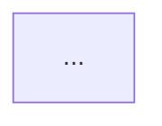

# Modeling

## Overview

ユーザーの要件をヒアリングし、以下のいずれかの設計手法を選択・実行する：

1. **データフロー設計**: データ変換・パイプライン処理
2. **ステートマシン設計**: 状態管理・振る舞いの設計
3. **複合設計**: 両方を組み合わせた設計

実装コードは書かず、設計図の提示で完了する。

### 動作モード

- **スタンドアロンモード**: 単独起動時、要件ヒアリングから開始
- **コンテキストモード**: arch連携時、引き継いだ情報を活用して設計手法判断から開始

## Context Information (arch連携時)

archスキルから以下の情報を引き継ぐことが可能：

### 引き継ぎ可能な情報
- **アプリケーション種別**: Web app, TUI, CLI, etc.
- **設計対象機能**: 機能名と概要
- **データ処理方法**: CRUD-focused / Pipeline-style / Complex business rules / Real-time
- **状態管理の複雑度**: Simple / Moderate / Complex
- **選択されたアーキテクチャパターン**: Clean Architecture / Vertical Slice / Flux

### 活用方法
これらの情報から設計手法を推定：
- データ処理方法が「Pipeline-style」→ データフロー設計寄り
- 状態管理が「Complex」→ ステートマシン設計寄り
- 両方の要素が強い → 複合設計

## Workflow

### Step 0: Context Handling

スキル起動時にコンテキスト情報の有無を確認：

**コンテキスト情報がある場合（arch連携時）:**
1. archから引き継いだ情報を要約して提示
2. 不足情報があれば補足質問（最小限）
3. → **Step 2（設計手法の判断）** へ進む

**コンテキスト情報がない場合（スタンドアロン起動時）:**
- → **Step 1（要件の初期ヒアリング）** へ進む

### Step 1: 要件の初期ヒアリング（スタンドアロン時のみ）

AskUserQuestion ツールで以下を確認：

**質問例:**
- 「どのような機能・システムを設計したいですか？」
- 「主な関心事は何ですか？」
  - データの変換・加工・フロー
  - システムの状態・振る舞い・ユーザーフロー
  - 両方

### Step 2: 設計手法の判断

**コンテキスト情報がある場合:**
1. archから得た「データ処理方法」「状態管理複雑度」を参照
2. 推奨される設計手法を提示（理由とともに）：
   - Pipeline-style + Simple state → データフロー設計
   - CRUD-focused + Complex state → ステートマシン設計
   - 両方の要素が強い → 複合設計
3. ユーザーに確認（変更可能）

**コンテキスト情報がない場合:**
要件から適切な手法を判断する。詳細は `references/method-selection.md` を参照。

#### データフロー設計を選択する場合

以下のいずれかに該当する場合：
- API連携、ETL処理、データパイプライン
- 「入力 → 処理 → 出力」の流れが明確
- データ変換・集計・フィルタリングが中心
- 関数型プログラミングの文脈

**例:**
- 「APIから取得したデータをフィルタして集計したい」
- 「CSVファイルを読み込んでJSONに変換したい」
- 「複数のデータソースをマージして出力したい」

→ **`references/dataflow.md` のワークフローを実行**

#### ステートマシン設計を選択する場合

以下のいずれかに該当する場合：
- ユーザーフロー、UI状態管理
- イベント駆動の振る舞い
- 「状態 → イベント → 次の状態」の関係が重要
- プロトコル、ワークフロー、ライフサイクル管理

**例:**
- 「ログイン機能の状態遷移を設計したい」
- 「注文処理のワークフローを明確にしたい」
- 「接続状態の管理ロジックを設計したい」

→ **`references/state-machine.md` のワークフローを実行**

#### 複合設計が必要な場合

両方の側面が重要な場合（例: データ処理を含む状態管理）：

**例:**
- 「ファイルアップロード機能（状態遷移 + データ処理）」
- 「リアルタイムデータ処理パイプライン（データフロー + 状態管理）」
- 「非同期ジョブシステム（状態遷移 + データ変換）」

**アプローチ:**
1. 主要な側面を先に設計（通常は状態遷移）
2. もう一方の側面を補完的に設計
3. 両者の整合性を確認し、統合ガイドを提示

### Step 3: 選択した手法の実行

判断した手法に応じて、該当するワークフローを実行する。

**データフロー設計:**
`references/dataflow.md` の Design Workflow に従って設計を進める。

**ステートマシン設計:**
`references/state-machine.md` の Design Workflow に従って設計を進める。

**複合設計:**
1. ステートマシン設計を先に実行（全体の状態と遷移を明確化）
2. 各状態や遷移で必要なデータフロー設計を実行
3. 両方の設計図を統合して提示

### Step 4: 設計成果物の提示

選択した手法に応じた成果物を提示する。

**データフロー設計の場合:**
1. 設計概要
2. データ構造定義（入力・中間・出力）
3. データフロー図（Mermaid/ASCII）
4. 変換ステップ詳細表
5. エッジケースと対応方針
6. 実装時の考慮事項

**ステートマシン設計の場合:**
1. 設計概要
2. 状態リスト
3. イベントリスト
4. ASCII状態遷移図
5. 状態遷移表
6. エッジケースと検証結果
7. 実装時の考慮事項

**複合設計の場合:**
- 上記両方の成果物
- 統合ガイド（状態とデータフローの対応関係）

### Step 5: 設計ファイルの出力

設計成果物をMarkdownファイルとして `docs/design/` に保存する。

**ファイル名:** `機能名-modeling.md`

**出力内容:**

データフロー設計の場合:
```markdown
# [機能名] - データフロー設計

## 機能概要
[機能の目的と概要]

## データフロー図


## データ構造
### 入力
[簡潔なスキーマ]

### 出力
[簡潔なスキーマ]

## 変換ステップ
| ステップ | 処理内容 |
|----------|----------|
| ... | ... |

## 実装時の考慮事項
- [重要なポイント]
```

ステートマシン設計の場合:
```markdown
# [機能名] - ステートマシン設計

## 機能概要
[機能の目的と概要]

## 状態遷移図


## 状態とイベント
### 状態
| 状態 | 説明 |
|------|------|
| ... | ... |

### イベント
| イベント | 説明 |
|----------|------|
| ... | ... |

## 状態遷移表
| 現在の状態 | イベント | 次の状態 | 条件 |
|------------|----------|----------|------|
| ... | ... | ... | ... |

## 実装時の考慮事項
- [重要なポイント]
```

**対話での出力（概要のみ、500字以内）:**
```
✓ 設計完了: [機能名]

出力: docs/design/[機能名]-modeling.md

[2-3文での機能概要と設計手法の簡潔な説明]
```

## Important Notes

- **コンテキスト対応**: arch連携時とスタンドアロン時で適切にワークフローを切り替える
- **手法選択を明示**: 選択した設計手法とその理由をユーザーに伝える（コンテキスト情報を活用した場合はその旨も説明）
- **柔軟な切り替え**: 途中で手法が不適切と判明した場合は切り替える
- **設計のみで完了**: 実装コードは書かない
- **対話重視**: 曖昧な点は必ず AskUserQuestion で確認し、推測で進めない
- **段階的な設計**: 一度にすべてを決めず、ユーザーと対話しながら段階的に設計を固める
- **重複ヒアリング回避**: arch連携時は既に得た情報を再度尋ねない（確認のみ）

## References

- `references/method-selection.md`: 設計手法の選択基準詳細
- `references/dataflow.md`: データフロー設計ワークフロー
- `references/state-machine.md`: ステートマシン設計ワークフロー
